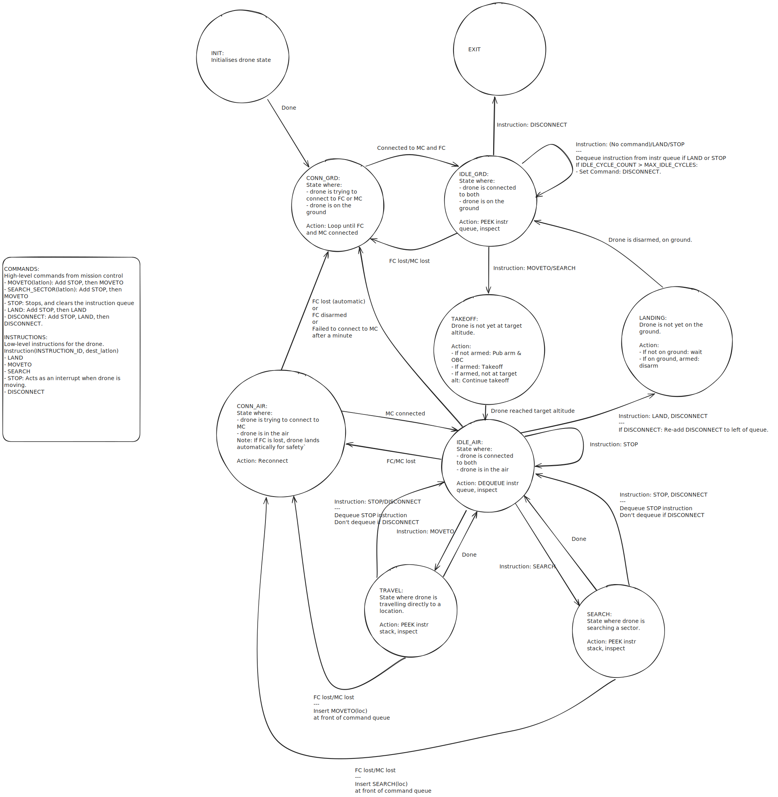

# IMPLEMENTATION

The drone works according to a state machine. It loops in each state, until the necessary requirements are achieved for it to progress to another state.

## Definitions
### Flight Controller (FC) Connected
This means that the onboard computer can successfully receive published messages from the flight controller. While this does not necessarily mean that the drone is *armed*, for the purposes of this state machine, "FC lost" also implies a sudden, unexpected FC disarming.

### Mission Control (MC) Connected
This means that the onboard computer is successfully exchanging heartbeat messages with Mission Control.
