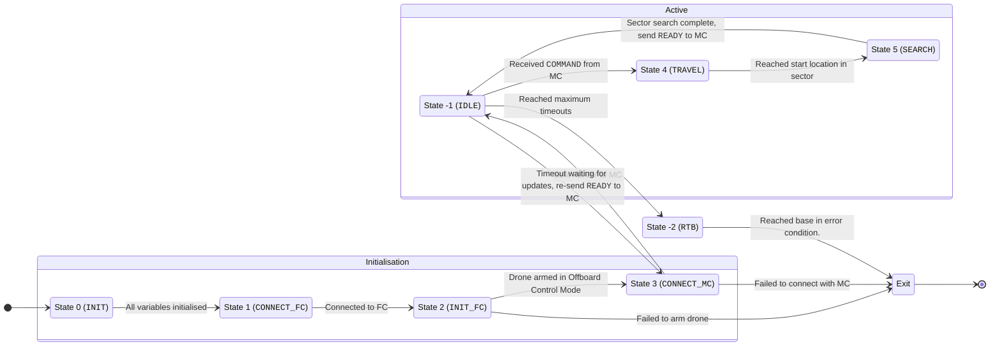

# IMPLEMENTATION

The drone works according to a state machine. The initialisation takes several stages for the onboard computer to exchange information with the flight controller. This is necessary to obtain the reference latitude and longitude that the flight controller is using to compute the NED local world frame which is used to evaluate `TrajectorySetpoint` messages passed to the flight controller (to actually move the drone).

This drone starts at **State 0 (`INIT`)**.

## State -2: `RTB`
Here, the drone has either reached an emergency condition (e.g. low battery, lost connection to mission control).

The drone in this state simply heads back to the last known latitude and longitude of Mission Control.

## State -1: `IDLE`
Here, the drone has either completed all instructions from Mission Control, or has yet to receive any new instructions.

The drone, in this state, returns to **State 3 (`CONNECT_MC`)** after a given timeout to retransmit its `READY` message (in case its earlier message was dropped).

After a certain number of timeouts, the drone returns to base (i.e. switches to **State -2 (`RTB`)**).

If the drone receives an `UPDATE` message from Mission Control, it is then able to initialise the target sector's probability map and start location and progress to **State 4 (`TRAVEL`)**.

## State 0: `INIT`
In this state, the ROS2 node initialises all variables with null values, and initialises the subscription to obtain the reference point (with the `VehicleLocalPosition` message).

## State 1: `CONNECT_FC`
This is run every few milliseconds, blocking any further progression of the onboard computer until the `VehicleLocalPosition` message is published by the flight controller.
- Without this information, the onboard computer cannot obtain the reference latitude and longitude.
- The system fails to initialise should this message fail to be received after a given amount of time.

Once the message is received, the subscription is destroyed (since it's no longer needed), and the system progresses to the next stage.

## State 2: `INIT_FC`
Here, the actual subscriptions and publishers that the onboard computer needs to communicate with the flight controller are initialised.
- Subscriptions:
    - `VehicleGlobalPosition`: This accesses the current latitude and longitude of the drone, allowing us to pass it on to the pathfinding algorithm and to know *when* we reach a particular point.
    - `VehicleCommandAck`: This is to see if a particular vehicle command has been successfully received by the flight controller.
- Publishers:
    - `TrajectorySetpoint`: This instructs the flight controller to begin moving to a particular `(x, y, altitude)` coordinate. `x` and `y` are defined in metres relative to a reference point, which we find in the `CONNECT_FC` state.
    - `VehicleCommand`: This allows us to pass arming commands and other arbitrary instructions to the flight controller.
    - `OffboardControlMode`: This acts as the 'heartbeat' message with the flight controller, and the stream of this messages must have a frequency of `2 Hz`. The onboard computer must continually publish this message to allow the drone to remain in offboard control mode (i.e. controlled by the onboard computer).

After the drone has been successfully **armed** (identified with `VehicleCommandAck`), the system progresses to the next stage.

## State 3: `CONNECT_MC`
Here, the onboard computer initialises its connection to Mission Control. It sends a `READY` message. The system then progresses to **State -1 (`IDLE`)**.
- Since it's possible for the message to be dropped, the `IDLE` stage uses timeouts to send more `READY` message if no commands are received.

## State 4: `TRAVEL`
Here, the onboard computer has received instructions from Mission Control. It initialises the search sector's probability map from the message, and travels to the start location within the search sector.

Once it reaches the start location (identified through the `VehicleGlobalPosition` subscription), it progresses to the next stage.

## State 5: `SEARCH`
Here, the onboard computer searches the sector.

It remains in this state until it has searched the entire sector. Once this is so, it sends a `READY` message to Mission Control, and re-enters **State -1 (`IDLE`)**.

